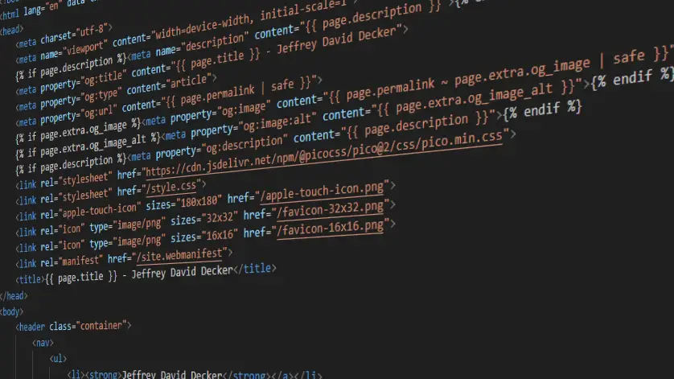

+++
title = "Hello World 👋"
description = "Learning to use Zola and setting up my blog"
date = 2025-03-17
draft = false

[extra]
og_image = "og.webp"
og_image_alt = "Stylized code image representing Jeffrey David Decker's website"
+++



Hello 👋! As a computer enthusiast, I'm always looking for new ways to learn and experiment with programming, design, and engineering.

For a long time, my online presence was just a simple Linktree style website, but I realized I wanted something more: a place to document my projects, share what I'm learning, and generally have a more online presence using my website.

In this post, I'll walk you through my process of setting up this blog, covering my choice of tools (Zola and Pico CSS), and how I'm hosting it on GitHub Pages.

## Why I chose Zola

I finally decided to expand my online presence with a blog. Static Site Generators (SSGs) are a way to build websites that are mostly pre-built and work well for blogs. Instead of generating pages every time someone visits, the site is built once, and those files are uploaded to the internet. This makes them fast, more secure, easy to host.

I wanted an SSG that:

* Didn't require me to install an environment to use (so no Python, Node.js, etc)
* Is a single binary if possible
* Easy to build my own templates

That ruled out popular options like Gatsby, Astro, Jekyll, and Pelican, leaving me with two top contenders: Hugo and Zola.

Hugo is the more popular of the two. I fiddled around with it for a bit, but I found the Go templating engine a bit less intuitive to what I was used to using.

Zola just clicked better for me. It uses a templating engine called [Tera](https://keats.github.io/tera/docs/).

Using Zola is as easy as visiting [GetZola.org](https://www.getzola.org/) and following the instructions. It's similar to Jinja2, which I'm familiar with from some Flask projects. Tera uses curly brackets and percent signs to mark template logic, which makes it easy to read and understand.

## Pico CSS for Styling

I've been exploring lightweight CSS frameworks for my projects. Lightweight CSS frameworks take a lot of the guesswork out of styling. They provide a base set of styles that you can easily customize, saving you time and effort.

Some of my favorites are:

* [MPV.css](https://andybrewer.github.io/mvp/)
* [Pico CSS](https://picocss.com/)
* [Pure.css](https://purecss.io/)
* [Sakura](https://oxal.org/projects/sakura/)
* [Simple.css](https://simplecss.org/)

For this blog, I chose Pico CSS. I hadn't used it in a project yet, and it's one of the most popular lightweight frameworks out there. I had used MPV.css recently, and liked it, but it's more rigid in it's default styles and wasn't what I was looking for. The default styles in Simple.css weren't really jibing with me for this project either. Pico CSS's clean default styles and ease of customization made it a good choice. Plus, with Pico, changing the color of buttons is as simple as tweaking one line of CSS.

Pico CSS can be implemented by downloading the file or via their CDN. [PicoCSS.com](https://picocss.com/) has instructions.

## Hosting on Github Pages

I had been hosting my Linktree-style personal site on [GitHub Pages](https://pages.github.com/), so I stuck with that. It's free, easy to use, and especially convenient if you've already using GitHub. A nice perk is that [GitHub Actions](https://github.com/features/actions) can be used to build and deploy the site on a git push. You can find an example of the GitHub Action for building a Zola site [here](https://github.com/marketplace/actions/zola-deploy-to-pages).

This is an example of what it looks like when I wrote this article:

``` yaml
name: Zola on GitHub Pages

on: 
 push:
  branches:
   - main  # Trigger on pushes to the main branch (rename to master if that is what your main branch is called)

jobs:
  build:
    name: Publish site
    runs-on: ubuntu-latest
    steps:
    - name: Checkout main
      uses: actions/checkout@v4  # check out the repository code
    - name: Build and deploy
      uses: shalzz/zola-deploy-action@v0.20.0  # Uses Zola v0.20.0 to build the site
      env:
        GITHUB_TOKEN: ${{ secrets.GITHUB_TOKEN }}  # This token is automatically provided by GitHub for deployment
```

Just drop this into a YAML file in `.github/workflows`. I called my file `zola-build.yml`.

Then set your Github Pages settings to *deploy from a branch* and set that branch to *gh-pages* and the *root* folder. I couldn't find a way to have it build to a folder in the main branch and have the site work, but GitHub Pages allows you to put your static website files in a branch called *gh-pages* to have your site visible to the public.


After you push your files to Github, then the action should create a branch called gh-pages and your site should be visible online.

## Conclusion

Setting up this blog with Zola and Pico CSS has been smooth and rewarding. If you're exploring SSGs or lightweight CSS frameworks, I hope this helps!
